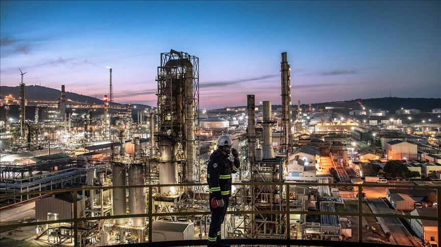

---

# ⚡ Energy Consumption & Environmental Impact Analysis

## 📌 Project Overview

This project provides a comprehensive analysis of **global energy consumption patterns** across multiple countries, energy sources, and economic sectors.
Using interactive dashboards, the project highlights **energy usage trends, sector-wise distribution, peak demand behavior, and environmental impact (CO₂ emissions)**.

The analysis is designed to support:

* Energy policy decision-making
* Sustainability & environmental studies
* Demand forecasting and capacity planning

---

## 📂 Dataset Information

**Dataset Name:**
`Energy_Consumption_Tableau_1000_Rows.xlsx`

**Number of Records:**
~1000 rows

**Granularity:**
Each row represents energy consumption data for a specific **country, energy type, sector, and year**.

---

## 🧾 Dataset Schema

### 🔹 Dimensions

| Column Name | Description                                      |
| ----------- | ------------------------------------------------ |
| Country     | Country name (India, China, USA, UK, Germany)    |
| Energy Type | Coal, Hydro, Nuclear, Solar, Wind                |
| Sector      | Agriculture, Commercial, Industrial, Residential |
| Year        | Year of observation                              |

### 🔹 Measures

| Column Name           | Description              |
| --------------------- | ------------------------ |
| Energy Consumed (GWh) | Total energy consumption |
| CO₂ Emissions (MT)    | Carbon dioxide emissions |
| Avg Demand (MW)       | Average power demand     |
| Peak Demand (MW)      | Peak load demand         |

---

## 📊 Dashboards Overview

### 1️⃣ Energy Consumption Overview Dashboard

**Purpose:**
To understand overall energy usage patterns across countries, sectors, and energy sources.

**Visuals Included:**

* **Country-wise Total Energy Consumption** (Bar Chart)
* **Energy Type vs Sector Consumption** (Heatmap)
* **Energy Type Contribution by Country** (Treemap)
* **Sector-wise Energy Usage Distribution** (Pie Chart)

**Key Insights:**

* Germany and the UK show higher total energy consumption
* Industrial and Residential sectors consume the most energy
* Coal and Nuclear dominate traditional energy usage

---

### 2️⃣ Demand & Environmental Impact Dashboard

**Purpose:**
To analyze demand behavior and environmental consequences of energy consumption.

**Visuals Included:**

* **Year-wise Energy Consumption Trend** (Line Chart)
* **Energy Consumption vs CO₂ Emissions** (Scatter Plot)
* **Distribution of Peak Demand** (Histogram)

**Key Insights:**

* Energy consumption shows an overall upward trend with fluctuations
* Higher energy consumption strongly correlates with higher CO₂ emissions
* Peak demand is concentrated in mid-to-high demand ranges

---

## 📈 Key KPIs Tracked

* Total Energy Consumption (GWh)
* CO₂ Emissions (MT)
* Average Demand (MW)
* Peak Demand (MW)
* Sector-wise Energy Share
* Energy Source Contribution

---

## 🔍 Business & Analytical Insights

* **Industrial sector** is the largest energy consumer across most countries
* **Renewable sources (Solar & Wind)** show steady growth
* **Coal-based energy** contributes significantly to CO₂ emissions
* Peak demand distribution helps identify stress points in power grids
* Long-term trends support **renewable energy transition planning**

---

## 🛠 Tools & Technologies Used

* **Visualization Tool:** Tableau
* **Data Source:** Excel
* **Chart Types Used:**

  * Bar Chart
  * Line Chart
  * Heatmap
  * Treemap
  * Pie Chart
  * Scatter Plot
  * Histogram

---

## 🎯 Use Cases

* Energy Analytics Portfolio Project
* Sustainability & Environmental Impact Studies
* Academic / Mini Project Submission
* Interview Demonstration Dashboard
* Power & Utility Demand Analysis

---

## 📌 How to Use the Project

1. Download the Excel dataset
2. Load it into Tableau
3. Assign correct data roles (Dimensions & Measures)
4. Create calculated fields if required
5. Build visuals using provided KPIs
6. Combine visuals into interactive dashboards
7. Apply filters for Country, Energy Type, Sector, and Year

---

## 📷 Dashboard Preview

> The repository includes screenshots of:

* Energy Consumption Overview Dashboard
* Demand & Environmental Impact Dashboard

---

## 👤 Author

**Project By:** *[Tejas Nandkishor Rajankar]*
**Domain:** Data Analytics | Energy & Sustainability

---

